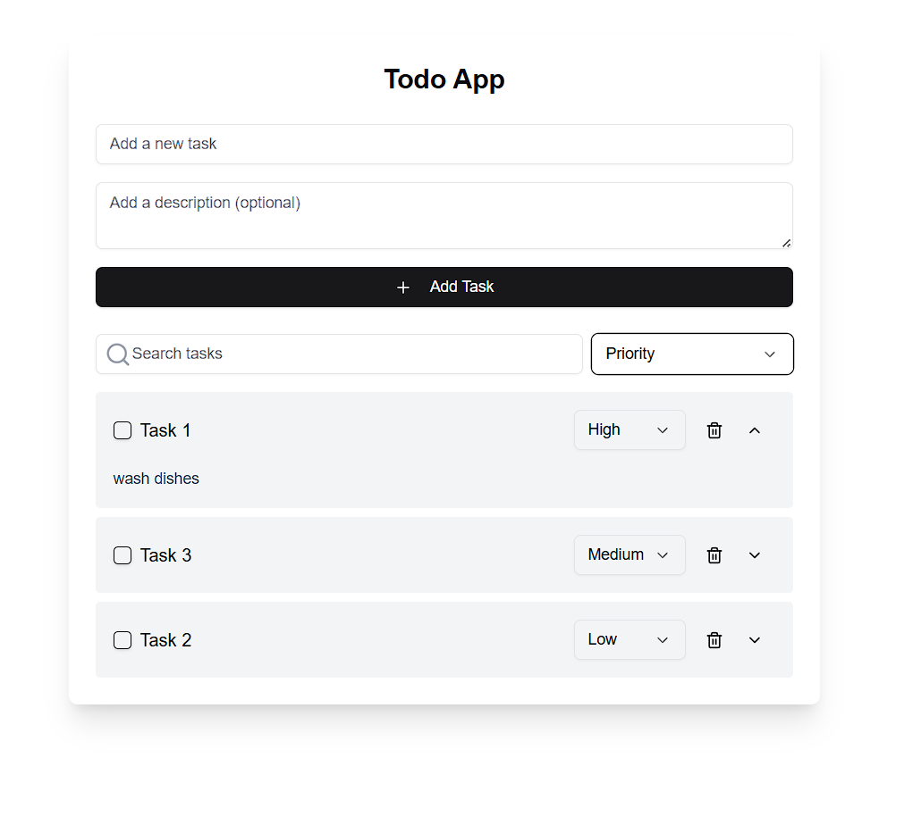
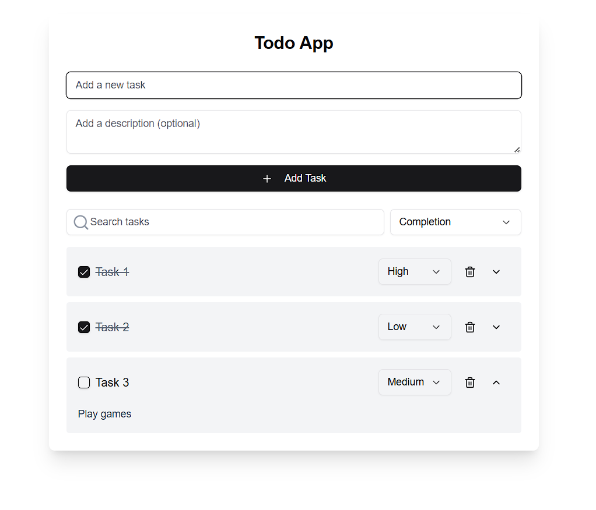

# Todo Application

A responsive Todo application built with React, TypeScript, and Framer Motion, designed to help manage tasks efficiently. This app offers core task management functionalities, such as adding, editing, and prioritizing tasks, along with persistence via local storage for a seamless user experience.

## Features

- **Add Tasks**: Create new tasks with an optional description.
- **Search and Sort**: Search tasks by title and sort them by priority, alphabetical order, or completion status.
- **Task Prioritization**: Assign priorities (Low, Medium, High) to each task.
- **Toggle Completion**: Mark tasks as completed and filter tasks based on completion status.
- **Local Storage Persistence**: All tasks are stored in the browser’s local storage, preserving them across page reloads.

## Setup and Launch

1. **Clone the Repository**:

   ```bash
   git clone <repository-url>
   cd <repository-directory>
   ```

2. **Install Dependencies**:
   Run the following command to install required dependencies:

   ```bash
   npm install
   ```

3. **Run the Application**:
   Start the development server with:

   ```bash
   npm run dev
   ```

   The application should now be running at `http://localhost:3000`.

4. **Build for Production**:
   To create a production build, use:
   ```bash
   npm run build
   ```

## Assumptions Made

- **Local Storage**: We assume the app will run in a browser environment with `localStorage` enabled. In a server-side rendering or non-browser context, `localStorage` might not be available.
- **React Environment**: The app assumes a React environment with TypeScript and all necessary dependencies (like Framer Motion and UI components) installed.
- **Basic Web Support**: The app assumes users have a modern browser (e.g., Chrome, Firefox, Safari) that supports features like localStorage and dynamic components.

## Screenshots

### Main View:




